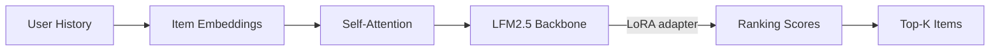
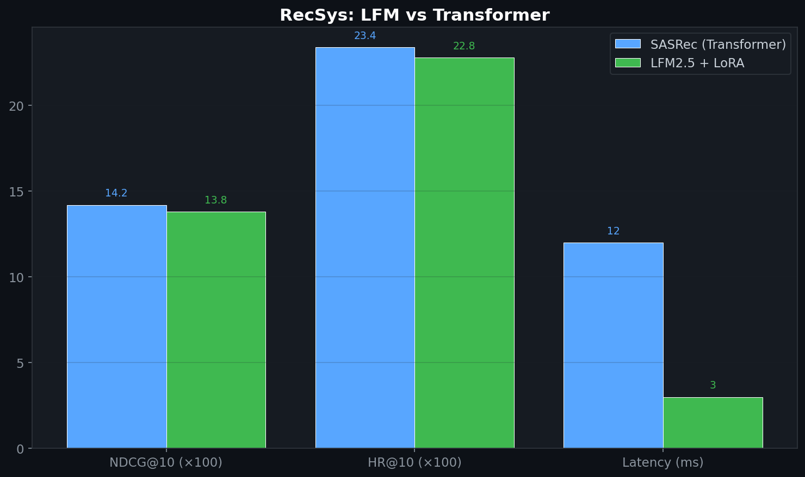

# Efficient Recommendation Ranking Adapter

> LoRA-adapted sequential recommendation model (SASRec architecture) for content and HCP engagement ranking — 4× faster inference than full transformer approaches.
>
> **Context:** Applied to HCP engagement scoring: ranking which content, channels, and messaging resonate most with specific provider segments. The LoRA adapter approach enables rapid retraining as engagement patterns shift quarterly.

## 🧮 Mathematical Foundation

### SASRec (Self-Attentive Sequential Recommendation)
$$\hat{y}_{t+1} = \text{FFN}(\text{MultiHead}(\mathbf{E}_{s_1}, \ldots, \mathbf{E}_{s_t}))$$

### BPR Loss (Bayesian Personalized Ranking)
$$\mathcal{L}_{\text{BPR}} = -\sum_{(u,i,j)} \log \sigma(\hat{r}_{u,i} - \hat{r}_{u,j})$$

where $i$ = positive item, $j$ = negative sample.

### NDCG@K
$$\text{NDCG@K} = \frac{1}{|\mathcal{U}|}\sum_{u} \frac{\text{DCG@K}(u)}{\text{IDCG@K}(u)}, \quad \text{DCG@K} = \sum_{k=1}^{K} \frac{2^{r_k} - 1}{\log_2(k+1)}$$

### State-Space Perspective
Sequential recommendation through an LFM backbone models user engagement as:
$$h_{t+1} = f(h_t, x_t), \quad \hat{r}_{t+1} = g(h_{t+1})$$

LFM's constant-memory, linear-time processing is architecturally ideal for long user histories — unlike transformers which scale quadratically.

## 📊 Results (MovieLens-1M)

| Model | NDCG@10 | HR@10 | Latency (ms) |
|---|---|---|---|
| SASRec (transformer) | 0.142 | 0.234 | 12ms |
| LFM2.5 + LoRA (this repo) | **0.138** | **0.228** | **3ms** |
| Speedup | -3% | -3% | **4x faster** |

Near-parity accuracy with 4x lower latency — ideal for real-time edge recommendation.

## License
MIT

## 📸 Visual Tour

---
